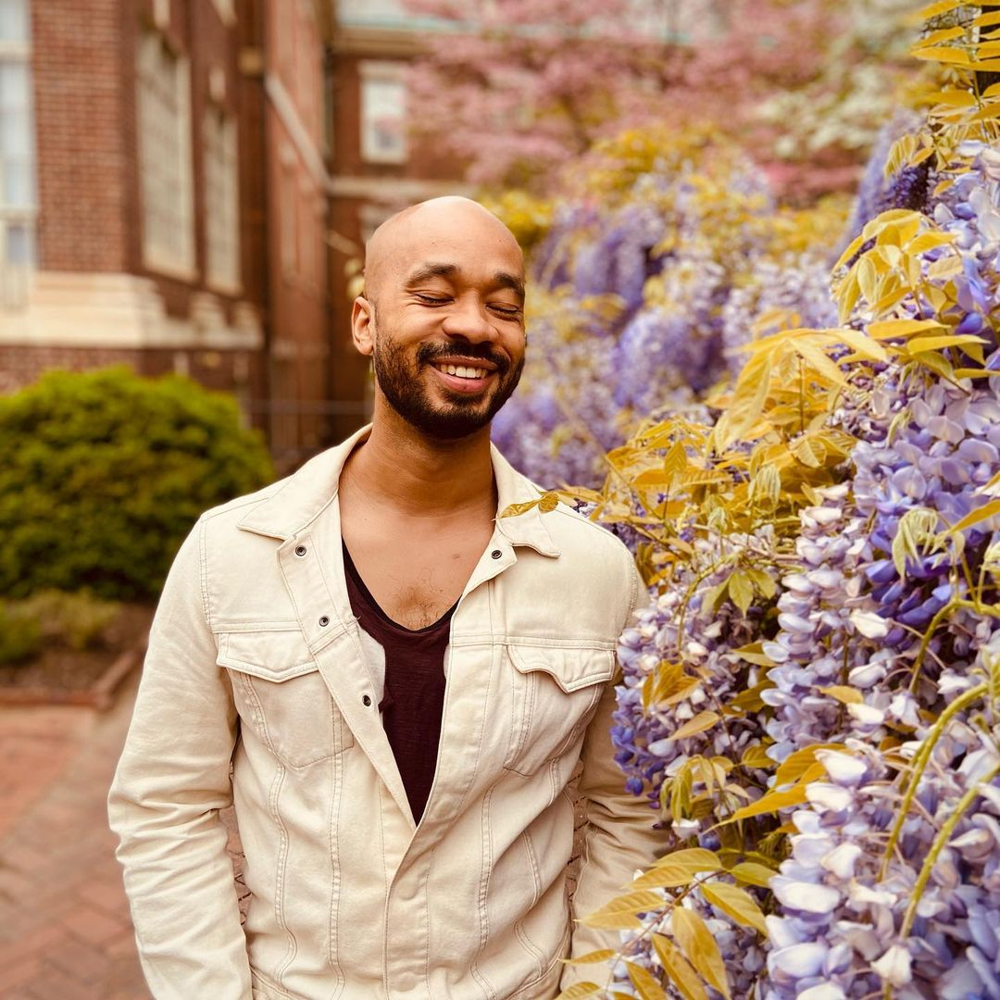

<h1 class="text-display" style="text-wrap: balance; font-size: 2.5rem">
make your most vital stories impossible to ignore
</h1>

::::: switch gap

<figure class="all-rounded">
  
</figure>

::: text-lede stack
I'm an interactive experience designer and creative consultant who remembers when "storytelling" didn't mean "advertising."
:::

From co-founding [Cipher Prime Studios](https://cipherprime.com) to producing [Emmy-winning journalism](https://inquirer.com/wildestdreams), I’ve spent nearly twenty years building worlds and sharing truths.

Now, I’m channeling that into [Futurefull](https://futurefullstories.com), and helping mission-driven orgs bring their wildest ideas to life.

::: card

:::





  
  
  

  

  ## the very best stories are the ones we tell together {.text-display}

  [Futurefull](https://futurefullstories.com) is a multicultural hub for artists dreaming through games, performance, and story. {.text-lede}

  [Join the community :fa-users:](https://futurefullstories.com){.button}

  

  

    INTERACTIVE SYSTEMS •  NARRATIVE ARCHITECTURE • GAME DESIGN • CREATIVE DIRECTION • THAT WEIRD SHIT • RAPID PROTOTYPING • POETRY • MUSIC • PERFORMANCE • ACTUAL PLAY • INTERACTIVE SYSTEMS •  NARRATIVE ARCHITECTURE • GAME DESIGN • CREATIVE DIRECTION • THAT WEIRD SHIT • RAPID PROTOTYPING • POETRY • MUSIC • PERFORMANCE • ACTUAL PLAY
  

### your creative accomplice 
## work with me {.text-display}

::::: content-wide stack



:::: content content-flush stack

I produce one-of-a-kind interactive experiences both on and offline. In practice, that often looks like interactive design, visual identity, and immersive performances.
{.text-lede}

I work primarily with mission-driven orgs and the studios that serve them. I don't do unethical corporate marketing. I do occasionally take projects just because they seem like fun, because joy is a human right.

Prototyping something quick? Designing an exhibition? Need a full-stack creative director? I'm game if you are.

:::: 

:::: content-wide content-flush switch gap-tight

::: card palette stack-tight text-center

### :fa-gamepad: Over 40 Game Industry Awards {.text-big}
:::

::: card palette stack-tight
### :fa-newspaper: Over a dozen News Design Awards {.text-big}
:::

::: card palette stack-tight
### :fa-cat: one gray cat{.text-big}
:::
::::

:::::

### Selected Projects
::::: content-full content-flush carousel








:::::

 

 

 

 {.bricks-tiny .list-plain .gap-loose .fit-contain .color-match .marquee .marquee-right}

## what people say {.text-display}
::::: content-full content-flush carousel

 






:::::





<h2 class="text-display  js-quote-animated" data-quotes="magical|fa-hand-sparkles, musical|fa-music, memorable|fa-book-bookmark, meaningful|fa-hands-clapping, mythical|fa-hat-wizard">
  let's make something <strong></strong> together
</h2>

### Currently booking for Summer 2026

If you don't have a big budget, and we're mission-aligned, I still wanna hear about it! I’m open to barter, skill swaps, mutual aid, co-creation—anything rooted in trust and care. Let’s figure out what feels fair for both of us.

[let's collab :icon-fist-bump:](/contact){.button}









